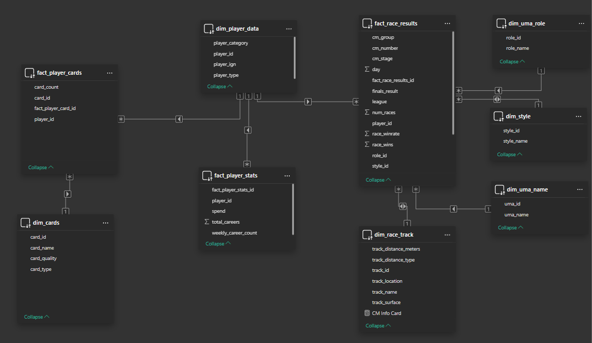

```
WHAT IS UMAMUSUME?

Umamusume: Pretty Derby is a race-horse inspired video game where players simulate careers
of famous race horses (Umamusume) that competed within the JRA (Japan Racing Association).


WHAT IS A CHAMPIONS MEETING?

A champion's meeting is a Player versus Player event within the video game, Umamusume: Pretty Derby.
Each players prepare and train three Trainees to compete against 2 other players each race.
One of the three Trainees must win the race in order to win for the team.

SCHEDULE BREAKDOWN:

Day 1 & 2 (Round 1):
--------------------
Up to 4 entries per day, compete in a best of 5 series ---> 20 Races per day, 40 Races total for Round 1
To proceed to Group A, you must win 3/5 races in a BO5 Series.
To proceed to Group B, you must win 1/5 races in a BO5 Series.
Otherwise, you are eliminated and do not move to the next round.
Meaning, you have 8 total attempts to win 3/5 races in a series.

Day 3 & 4 (Round 2):
--------------------
Up to 4 entries per day, compete in a best of 5 series ---> 20 Races per day, 40 Races total for Round 2

IN GROUP A:
To proceed to Group A Finals, you must win 3/5 races in a BO5 Series.
To proceed to Group B Finals, you must win 1/5 races in a BO5 Series.
Otherwise, you are eliminated and do not move to the next round.

IN GROUP B:
To proceed to Group B Finals, you must win 3/5 races in a BO5 Series.
Otherwise, you are eliminated and do not move to the next round.

Finals:
 --------------------
A single final race. Your best uma's placement, relative to others, determines your placing.

For example, 
Player A's best Umamusumes have taken 1st place and 3rd place. -> 1st Place
Player B's best Umamusume has taken 2nd and 4th place. -> 2nd Place
Player C's best Umamusume has taken 5th place. -> 3rd Place


```
# Umamusume: Champions Meeting Survey ETL


This project includes an E2E DE pipeline to structure and normalize CM (Champions Meeting) Performance records in Umamusume. 

It transforms raw survey data into a structured Star Schema in BigQuery using dbt.

## <u>Project Scope</u>

The goal is to use the CSVs of the survey data collected by MooMooCow and team, then pipe the data into BigQuery, where it will follow a Medallion Architecture. 

This project loosely follows an ELT (Extract, Load, Transform). The data is loosely cleaned prior to insertion due to the utility of Python packages (Hugging Face, PyTorch) for binning responses based on ML identified groupings. See src/utils/global_cleaning_operations.py for specific details.

### 1. Ingestion/Extraction
*   **Python/Polars:** Reads raw CSV survey data. Fixes row data and combines day records. Prepares formatting for BQ
*   **ML Categorization:** Leverages `transformers` (BART Large MNLI) to categorize open-ended responses into player personas: *Competitive, For Fun (Oshi), Casual,* and *Burnt Out*.
*   **BigQuery Load:** Loads the enriched Bronze data into BigQuery as the source for dbt.

### 2. Transformation
*   **Bronze:** Create an abstraction layer between database and dbt.
*   **Silver:** Standardizes columns and unifies the data
*   **Gold:** Pivot data for a horizontal structure. Aggregate information and structure the data in a Fact-Dimension format.
    * ###  **Fact Table:** 
    * `fact_player_cards` (Support cards owned by players)
    * `fact_player_stats` (Total Careers, Careers per week, Money Spent)
    * `fact_race_results` (All Race information)
    *  ###  **Dimension Tables:** 
    * `dim_cards` (Card ID, Card Name, Card Quality, Card Type).
    * `dim_device_type` (Uma ID, Uma Name)
    * `dim_player_data` (Player ID, Player Category)
    * `dim_race_track` (All CM Track related information)
    * `dim_style` (Style ID, Style Name)
    * `dim_uma_style` (Role ID, Role Name)
    * `map_cards` (Card ID, Column Name)
    * ### **ERD:**
    

## Tech Stack
*   **Orchestration/ETL:** Python 3.12, dbt
*   **AI/ML:** PyTorch, Hugging Face Transformers, Scikit-Learn
*   **Data Warehouse:** BigQuery
*   **Visualization/ERD:** PowerBI

## <u>Requirements</u>

### 1. Prerequisites
* **Docker Desktop**: Ensure **WSL 2 backend** is enabled in Settings.
* **NVIDIA Drivers**: If you have an NVIDIA GPU, check Dockerfile CUDA version for supported version if you wish to run PyTorch w/ GPU
* **GCP Service Account**: A JSON key file for BigQuery access. Place within your data/ folder.

### 2. Configuration
Create a `.env` file in the project root:
   ```env
    GCP_PROJECT_ID = "your_project_id_here"
    GCP_BRONZE_DATASET_ID= "your dataset_id here"
    GCP_SILVER_DATASET_ID= "your dataset_id here"
    GCP_GOLD_DATASET_ID= "your dataset_id here"
    GOOGLE_APPLICATION_CREDENTIALS = "your_token_here"
    GOOGLE_APPLICATION_CREDENTIALS_PATH = "your_json_path_here"
   ```

Update Dockerfile with an appropriate Torch version for your GPU:
   ```env
   ARG TORCH_VERSION="cu128"
   ```
### 3. Build the Image
This installs Python 3.12 and GPU-optimized PyTorch 2.7+.
```powershell
docker build -t uma-cm-etl .
```

### 4. Run the Pipeline
We mount the local `data/` folder so the container can access your CSVs and GCP Key.
```powershell
docker run --gpus all --env-file .env -v "${PWD}/data:/app/data" uma-cm-etl
```

---

## 🛠 Project Structure
* `main.py`: Entry point for ETL and Hugging Face classification.
* `dbt_uma/`: dbt project folder (requires **dbt v1.12+** for Python 3.12 support).
* `data/`: Storage for raw CSVs
* `pyproject.toml`: Dependency management (Torch, Polars, dbt).

---
